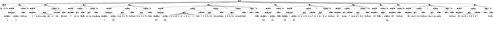

# GreekSchools Domain-Specific Languages
[![GreekSchools Logo][gs-logo]][gs]

This repository hosts the Context-Free Grammars for the Domain-Specific Languages developed within the GreekSchools project.


The DSL-Based DSE Methodology CophiEditor: [cophieditor.greekschools.eu][editor] 

## About
The **ERC Advanced Grant 885222-GreekSchools, The Greek Philosophical Schools according to Europe’s Earliest ‘History of Philosophy’: Towards a New Pioneering Critical Edition of Philodemus’ Arrangement of the Philosophers** (European Commission, Horizon 2020, ‘Ideas’, [https://greekschools.eu][gs], *PI: G. Ranocchia*) aims to provide a new critical edition, with introduction and commentary, of Philodemus of Gadara’s Arrangement of the Philosophers, a treatise in several books handed down by eight Herculaneum Papyri.

A crucial part of GreekSchools is engaging the scholarly community in a permanent collaborative review in progress of our critical edition by launching a new open-source scholarly Web platform on which the critical texts will be uploaded and be made available open-access, for papyrological and exegetical comments. The platform is composed by two different parts: a textual editing tool, and the open access viewer of the critical text. 

The repository provides Context-Free Grammars for Domain-Specific Languages designed to encode machine-actionable diplomatic and literary transcriptions of the Herculaneum Papyri, together with palaeographic and critical apparatuses, as well as modern translations.

This material is permanently made accessible open access following the requirements foreseen for the project by the European Commission under the Horizon 2020 research and innovation programme. 

## Goal
The goal is to create a flexible environment for scholarly editing critical texts constantly monitored by the community by making both digital texts and facsimiles remotely accessible through a single interface with advanced capabilities.


## Run GS-DSLs

### Requirements
- Java (version 11 or higher)
- [ANTLR][antlr] (version 4.9.1-complete.jar or highter)

### Run locally (for Linux and Unix-like systems, such as macOS)
Create aliases for the ANTLR Tool, and `TestRig`.

```bash
$ alias antlr4='java -Xmx500M -cp "/path/to/lib/antlr-<version>-complete.jar:$CLASSPATH:./*" org.antlr.v4.Tool'
$ alias grun='java -Xmx500M -cp "/path/to/lib/antlr-<version>-complete.jar:$CLASSPATH:./*" org.antlr.v4.gui.TestRig'
```

Testing the ANTLR Tool via grammar compilation:

```bash
$ antlr4
ANTLR Parser Generator  Version 4.9.1
 -o ___              specify output directory where all output is generated
 -lib ___            specify location of grammars, tokens files
 -atn                generate rule augmented transition network diagrams
 -encoding ___       specify grammar file encoding; e.g., euc-jp
 -message-format ___ specify output style for messages in antlr, gnu, vs2005
 -long-messages      show exception details when available for errors and warnings
 -listener           generate parse tree listener (default)
 -no-listener        don't generate parse tree listener
 -visitor            generate parse tree visitor
 -no-visitor         don't generate parse tree visitor (default)
 -package ___        specify a package/namespace for the generated code
 -depend             generate file dependencies
 -D<option>=value    set/override a grammar-level option
 -Werror             treat warnings as errors
 -XdbgST             launch StringTemplate visualizer on generated code
 -XdbgSTWait         wait for STViz to close before continuing
 -Xforce-atn         use the ATN simulator for all predictions
 -Xlog               dump lots of logging info to antlr-timestamp.log
 -Xexact-output-dir  all output goes into -o dir regardless of paths/package
 ```

Testing the TestRig Tool:

```bash
$ grun
java org.antlr.v4.gui.TestRig GrammarName startRuleName
  [-tokens] [-tree] [-gui] [-ps file.ps] [-encoding encodingname]
  [-trace] [-diagnostics] [-SLL]
  [input-filename(s)]
Use startRuleName='tokens' if GrammarName is a lexer grammar.
Omitting input-filename makes rig read from stdin.
```

### Examples
Run the ANTLR tool on the `EuporiaLexer.g4` and then on `Euporia.g4`:

```bash
$ antlr4 EuporiaLexer.g4
$ antlr4 Euporia.g4
$ javac Euporia*.java
```

Run the `TestRig` tool on the `doc.txt` DSL:
```bash
$ grun Euporia start doc.txt -tree
```

```bash
(start (colRef Col. 64 \n) (line (lineRef (lineRange (startLine 3) - (endLine 8))) (reading (editor Sudhaus)) \n) (line (lineRef (singleLine 6)) (reading (text  ὑπόκωφον ἦν οὐτ’ η ) (operation del.) (editor librarius)) \n) (line (lineRef (singleLine 7)) (reading (text τά γ̣ε) (editor Fiorillo)) : (reading (text τά τ̣ε) (editor Armstrong)) \n) (line (lineRef (lineRange (startLine 9) - (endLine 10))) (reading (text [ µη ] | δέ) (editor Sudhaus)) : (reading (text [ οὐ ] | δέ) (editor Blank)) \n) (line (lineRef (lineRange (startLine 10) - (endLine 11))) (reading (text ἐ [ πι ] | κ { α } ρ̣ ‹ α › τ̣εῖν) (gsEditor *)) : (reading (text ἐ [ ᾶι ] | κάπ̣τ̣ειν) (editor Henry)) : (reading (text ἐ [ ᾶι ] | κρ̣α̣τ̣εῖν) (editor Blank)) (cetera , cetera (editor Cirillo)) \n) (line (lineRef (lineRange (startLine 12) - (endLine 16))) (reading (editor Cirillo)) \n) (line (lineRef (lineRange (startLine 17) - (endLine 18))) (reading (text λε [ ί ] | π̣ων) (gsEditor *)) : (reading (text λέ | [ γ ] ων) (editor Sudhaus)) \n) (line (lineRef (singleLine 18)) (reading (text ἐποίε̣ι̣) (gsEditor *)) : (reading (text ἐποιε [ ῖ ] τ’) (editor Sudhaus)) ) \n) (line (lineRef (singleLine 19)) (reading (editor Cirillo _ (postCorr Cpc))) \n) (line (lineRef (singleLine 20)) (reading (editor Sudhaus)) \n) (line (lineRef (singleLine 21)) (reading (text πέφ̣ [ υκε) (editor Sudhaus)) : (reading (text πέφ̣ [ ηνε) (editor Janko)) (cetera , cetera (editor Sudhaus)) \n) (line (lineRef (singleLine 23)) (reading (text πρὸ ] ϲ̣ δ̣ [ έ ]) (gsEditor *)) (cetera , cetera (editor Sudhaus)) \n))
```

```bash
$ grun Euporia start doc.txt -gui
```


## License

### GNU LESSER GENERAL PUBLIC LICENSE Version 2.1, February 1999

© 2025 [ERC Advanced Grant 885222-GreekSchools][gs] All Rights Reserved.


## Credits
* Principal Investigator: Graziano Ranocchia, Università di Pisa

* Logo design: Laura Attisani, Consiglio Nazionale delle Ricerche, Istituto di Scienze del Patrimonio Culturale

* Digital project: Angelo Mario Del Grosso (CNR-ILC), Federico Boschetti (CNR-ILC), Simone Zenzaro (CNR-ILC)

## Contact
**Graziano Ranocchia**

	Università di Pisa
	Dipartimento di Filologia, Letteratura e Linguistica
	Piazza E. Torricelli, 2
	I-56126 Pisa, Italy
	graziano (dot) ranocchia (at) unipi (dot) it

[gs]: https://greekschools.eu
[gs-logo]: https://greekschools.eu/wp-content/uploads/2021/01/logo-gs.png
[editor]: https://cophieditor.greekschools.eu
[antlr]: https://github.com/antlr/website-antlr4/tree/gh-pages/download